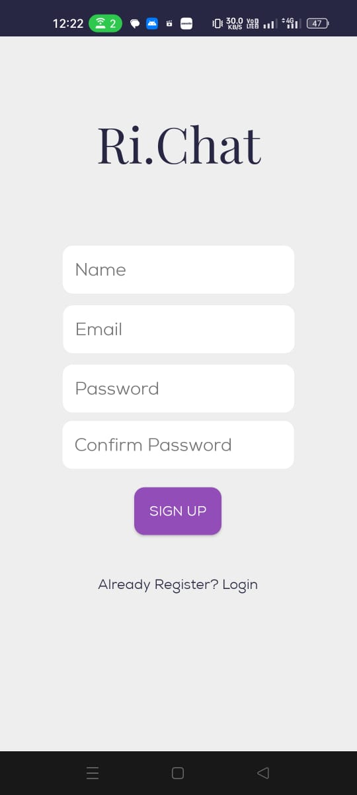
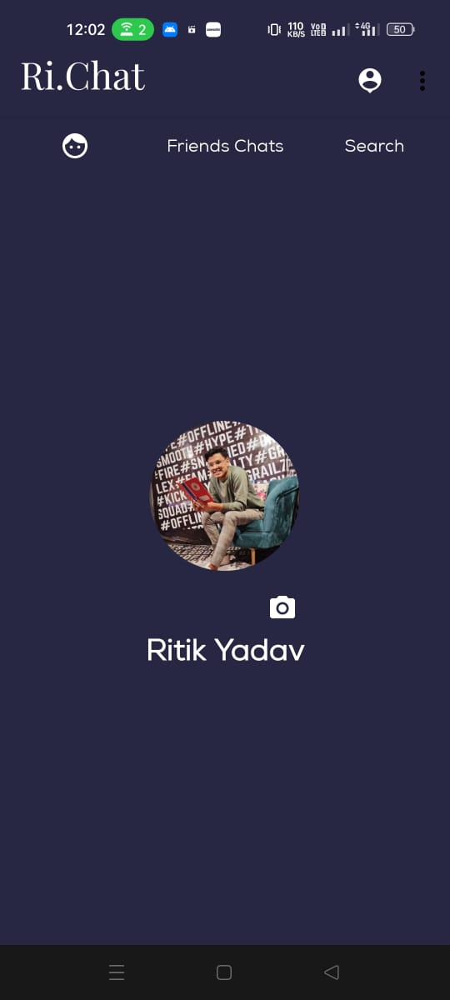
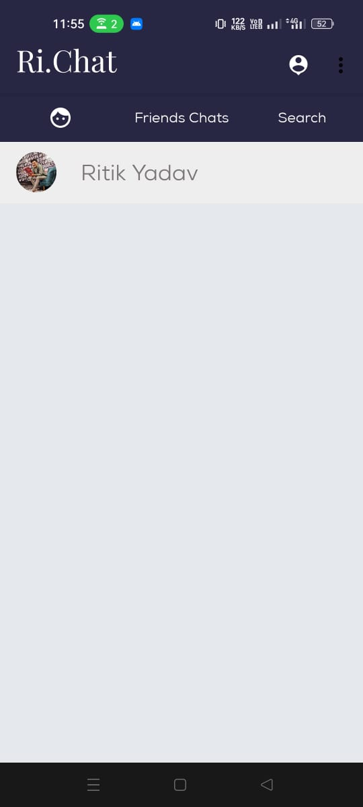
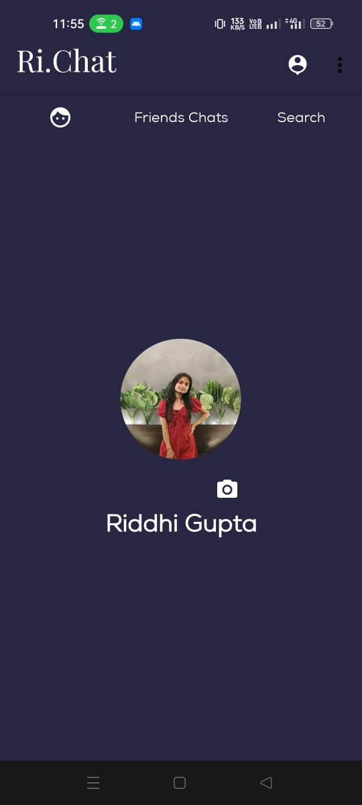
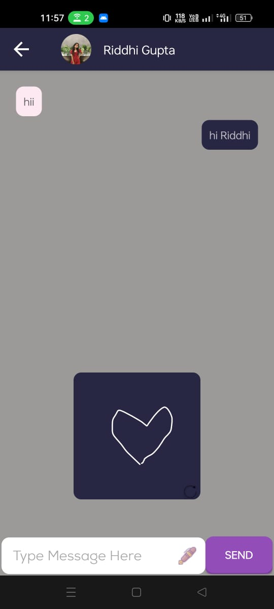
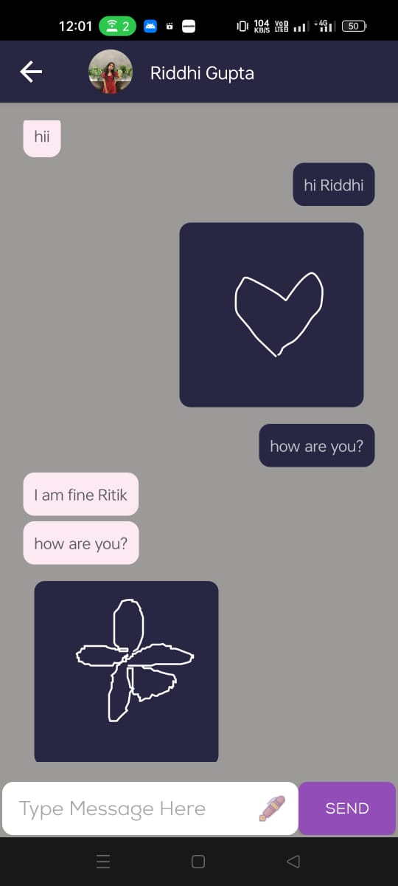
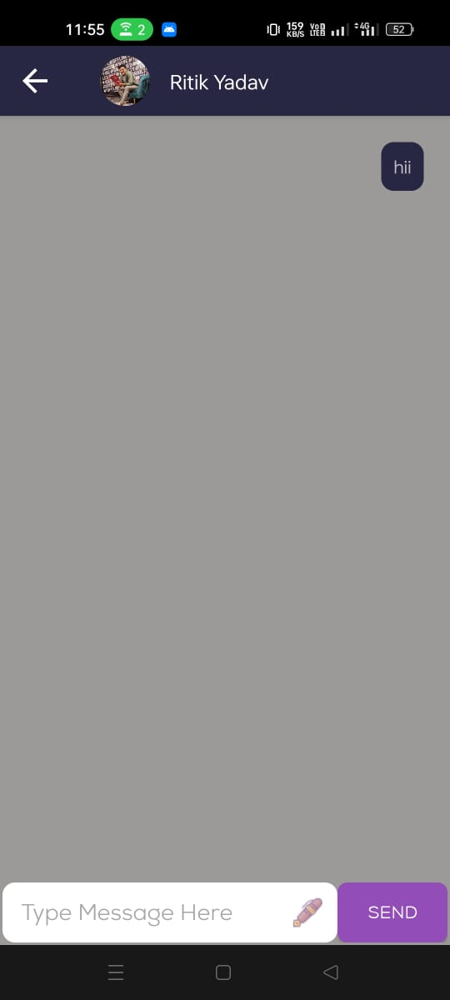
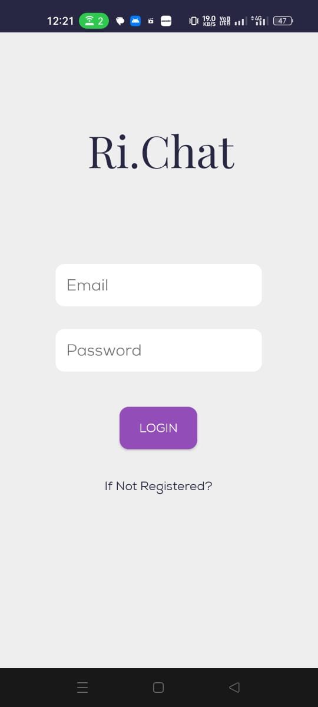

<h1>Ri.chat - A Drawing Chat App</h1>

Ri.chat is a real-time chat application that allows users to communicate with each other through text messages and a unique drawing feature. Users can exchange messages while also drawing and sharing their creative artwork with friends.

<h2>Technologies Used</h2>

<ul>
  <li><strong>Kotlin</strong>: Ri.chat is primarily built using Kotlin, a modern and statically typed programming language for Android development.</li>
  <li><strong>XML</strong>: XML is used for layout design and UI elements within the app.</li>
  <li><strong>Firebase Database</strong>: Firebase Realtime Database is used to store and sync the chat messages and drawings in real-time.</li>
</ul>

<h2>Features</h2>

<ul>
  <li><strong>Real-time Chatting</strong>: Users can send and receive text messages in real-time with their contacts.</li>
  <li><strong>Drawing Chat</strong>: A unique feature where users can draw and share their drawings in the chat.</li>
  <li><strong>User Authentication</strong>: Secure authentication system to manage user accounts and profiles.</li>
  <li><strong>Message History</strong>: View and refer to previous conversations and drawings.</li>
</ul>

<h2>Installation</h2>

To use Ri.chat, follow these steps:

<ol>
  <li><strong>Clone the repository:</strong>
    <pre><code>git clone https://github.com/Ritiky23/Ri.chat.git</code></pre>
  </li>
  <li><strong>Open the project in Android Studio.</strong></li>
  <li><strong>Build and run the app on an Android emulator or device.</strong></li>
</ol>

<h2>Usage</h2>

<ol>
  <li><strong>Launch the app and create an account or log in.</strong></li>
  <li><strong>Start a conversation with a contact or friend.</strong></li>
  <li><strong>Send text messages and also try the drawing feature to share creative drawings during the chat.</strong></li>
  <li><strong>Enjoy chatting and drawing with Ri.chat!</strong></li>
</ol>

<h2>Screenshots</h2>

  

  

  

  

  

  

  

  

<h2>Contributing</h2>

Contributions to Ri.chat are welcome! If you have ideas for new features, enhancements, or find bugs, please open an issue or create a pull request.

<h2>License</h2>

This project is licensed under the MIT License.

